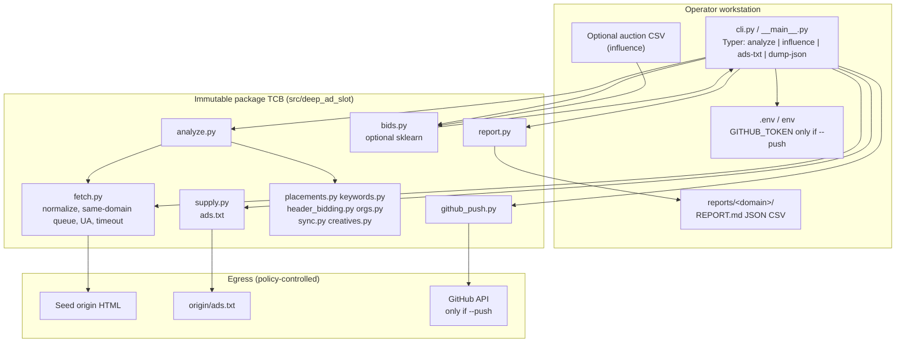
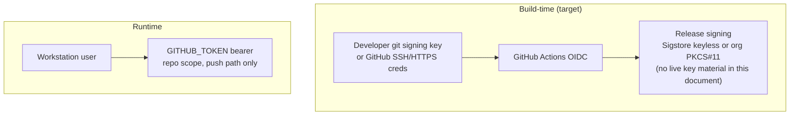

# Deep Ad Slot — Requirements Analysis and High-Level Architecture

| Field | Value |
| --- | --- |
| Document ID | DAS-SSB-ARCH-001 |
| Baseline | DAS-SSB-2026-001 v1.0.0-increment-1 |
| Product | Deep Ad Slot 0.1.0 |
| Status | Engineering baseline (not an authorization decision) |
| Date | 2026-08-24 |
| Classification | Unclassified; no CUI claimed by this document |

## 1. Authority limits

This document is engineering guidance. It is not an official U.S. Government issuance, does not grant or imply ATO, does not create collection authorities under EO 12333, and does not publish key material, exploit methods, or classified configurations. NIST SP 800-37 Rev. 2 is applied for process alignment only.

## 2. Purpose and product context

Deep Ad Slot is a **publisher / media-kit helper CLI**. An operator supplies a website URL they own or have permission to audit. The tool:

1. Fetches the seed URL and a bounded number of same-domain HTML pages.
2. Detects layout landmarks (header, nav, article, sidebar, footer).
3. Detects ad tech and header-auction wrappers in HTML.
4. Maps demand and tracker organizations observed in markup.
5. Flags **client identifier-match (cookie-sync) URLs** as a lower bound on browser-visible sharing.
6. Ranks recommended ad slots with formats and implementation notes (relative scores, **not** live CPMs).
7. Extracts keywords and commercial variants.
8. Optionally ranks which tracker flags move bidder CPMs from an operator-supplied auction CSV (`influence`), using optional scikit-learn random forest.
9. Optionally fetches `ads.txt`.
10. Optionally creates a GitHub repository and pushes a briefing (`--push`).

**Not claimed:** CPM guarantee; live exchange prices; complete demand graph (server-side partners and consent-gated JS are invisible); general web surveillance; consent-wall bypass.

Stack (verified against the live repo): Python ≥3.10; setuptools `src/` layout; CLI `deep-ad-slot` → `deep_ad_slot.cli:app` (Typer); runtime dependencies httpx, beautifulsoup4, lxml, typer, rich, python-dotenv; optional scikit-learn. MIT license. Author metadata: Quantum Research Laboratories LLC.

## 3. Stakeholders

| Stakeholder | Interest | Security-relevant need |
| --- | --- | --- |
| Publisher / ad-ops operator | Media-kit briefing for a site they control | Permissioned use; predictable local reports; no surprise GitHub side effects |
| Product developers | Maintain analysis quality and CLI UX | Pinned releases; tests on pure functions; no secrets in git |
| Security reviewer / C-SCRM | Supply-chain and data-handling assurance | SBOM/VEX, SAST/secret scan, documented residual risk |
| GitHub account owner | Token used only for intended briefing repos | Least-privilege PAT; default-private repos |
| Acquiring program (if any) | Fit to RMF process | Program-confirmable categorization; this baseline is not an ATO |

## 4. System categorization guidance (program-confirmable)

Deep Ad Slot 0.1.0 is a **local CLI** with **egress-only** networking. It is not a multi-user service. FIPS 199 / SP 800-60 impact is proposed as follows for a typical publisher-operator deployment. A U.S. Government acquirer must confirm; this is not an authorization.

| Security objective | Proposed impact | Rationale |
| --- | --- | --- |
| Confidentiality | **Low** for layout/keyword-only runs; **Moderate** when `GITHUB_TOKEN`, auction CSVs, or `cookie_syncs.json` are in scope | Public HTML is Low. Tokens, bid logs, and identifier-bearing URLs can be Moderate. No High-impact mission data is processed by design. |
| Integrity | **Moderate** | Tampered placement scores or a poisoned dependency can mislead a publisher’s inventory decisions and, if `--push` is used, publish a false briefing under the operator’s GitHub identity. Not a safety system. |
| Availability | **Low** | Workstation CLI; operator can re-run. No SLA. Raise to Moderate only if wrapped as a hosted service. |

**Proposed 800-53B baseline:** Low, with a **Moderate overlay on AC/IA/AU/SC/SR/SI** whenever the production profile enables `--push` or processes auction CSVs. Selecting Moderate wholesale is acceptable for programs that do not want a split baseline.

If a program later hosts Deep Ad Slot as a multi-tenant service, recategorize (likely Moderate/Moderate/Moderate) and apply NIST SP 800-204. CNSSI 1253 applies **only** if that hosted system is categorized as an NSS.

### 4.1 Domain standards — apply or record N/A

| Standard | Disposition | Rationale |
| --- | --- | --- |
| NIST SP 800-53 Rev. 5 / 800-53B | **Apply** (proposed Low + Moderate overlay as above) | Control IDs in this baseline |
| NIST SP 800-37 Rev. 2 | **Process alignment only** | No ATO package in this increment |
| NIST SP 800-218 SSDF v1.1 | **Apply** | PO/PS/PW/RV mapped in §17 |
| NIST SP 800-218A | **N/A** | Optional scikit-learn is classical ML trained ephemerally on operator CSV; no generative or dual-use foundation model is shipped |
| NIST SP 800-161 Rev. 1 | **Apply** | Python third-party intake and SBOM |
| NIST SP 800-204 series | **N/A (current)** | Not a microservice deployment; revisit if an API wrapper is added |
| NIST SP 800-63 | **Partial** | No first-party digital identity. GitHub is the IdP for optional `--push` (bearer PAT). Operator workstation identity is out of product TCB |
| CISA Secure by Design; CISA 2026 SBOM minimum elements | **Apply** | SPDX 3.x primary; CycloneDX optional; VEX required on release |
| CISA/G7 SBOM-for-AI | **N/A** | No AI model artifact is released |
| DoDI 8510.01 | **Conditional** | Only if a DoD acquirer includes this CLI in a system |
| SRG/STIG | **Benchmark only** | Not STIG certified |
| CNSSI 1253 | **Conditional** | NSS overlay only if the program so categorizes |
| ISO/IEC/IEEE 12207, 15288 | **Apply** (lightweight) | Life-cycle and architecture documentation |
| ISO/IEC/IEEE 29119 | **Apply** (target) | Test IDs in profile contract |
| ISO/IEC 27001 / 27034 | **Apply as guidance** | Application-security activities, not a claimed certification |
| OpenChain ISO/IEC 5230 | **Apply** | MIT + dependency license inventory |
| OWASP (ASVS selected; outbound HTTP and secret handling) | **Apply** | httpx client, PAT, path safety |
| CERT Python secure coding | **Apply** | Parser and path handling |
| IEC 62443-4-1/4-2 | **N/A** | Not industrial control / OT |
| ISO/SAE 21434; ISO 26262 | **N/A** | Not automotive |
| ISO 13485 / IEC 62304 | **N/A** | Not medical device software |

## 5. In-scope capabilities (this increment specifies; 0.1.0 implements a subset)

| # | Capability | 0.1.0 state | Target |
| --- | --- | --- | --- |
| 1 | Identity of builders, signers, runtime principals | Git history; PAT principal via `GET /user` on push | Signed tags; CI OIDC; PAT only for `--push` |
| 2 | Integrity of source, build, artifacts | Public git; floating `>=` pins in `pyproject.toml` / `requirements.txt` | Lockfile on release; signed wheel/tag; SBOM stored with artifact |
| 3 | Confidentiality of secrets and sensitive data | `.env` gitignored (**present**); token can appear in GitHub error text (**gap**) | Secret manager or env-only; redacted errors; report sensitivity tiers |
| 4 | Least-privilege authorization | PAT `repo` scope documented; `--push` is opt-in; default `private=True` (**present**) | Fail closed without flags; no standing cloud admin |
| 5 | Secure defaults in `prod` | Token not required unless push; User-Agent identifies product | Rate limits; no credential logging; no floating deps on tags |
| 6 | SBOM + C-SCRM intake | **Absent** | SPDX 3.x + VEX meeting CISA 2026 minimum elements |
| 7 | Signed authenticated update | Git clone / `pip install -e .` | Signed tags; optional wheel attestations; documented rollback to previous tag |
| 8 | Logging and audit with minimization | Rich console tables; no structured audit log | Target URL + status yes; token values and full HTML no |
| 9 | Testable control implementations | **No tests directory** | Unit tests for fetch/parse/score; CLI smoke without network; secret-scan CI |
| 10 | Permissioned-use ethics | README constraint (**present**); not enforced in CLI | CLI warning; documented robots.txt/ToS guidance; no unauthorized crawl features |

## 6. Security-relevant functional requirements

IDs are stable for the traceability seed (`FR-DAS-*`). Primary control mappings are representative, not a full 800-53 catalog.

| ID | Requirement | Primary 800-53 | SSDF | Test ID (seed) |
| --- | --- | --- | --- | --- |
| FR-DAS-01 | Operator must explicitly pass `--push` to cause GitHub side effects. Absence of the flag means local report only. | AC-3, AC-6 | PW.1 | TEST-PUSH-01 |
| FR-DAS-02 | `GITHUB_TOKEN` is read only from the environment or a gitignored `.env`. It is never written to reports, console tables, or git. | IA-5, SC-12, SC-28 | PS.1 | TEST-SEC-01 |
| FR-DAS-03 | Fetch is origin-bounded: seed plus same-domain HTML only, with a hard `--max-pages` cap (current CLI max 15). Cross-domain redirect of the seed must not silently expand the crawl (**target**; 0.1.0 follows redirects). | SC-7, SC-23 | PW.5 | TEST-FETCH-01 |
| FR-DAS-04 | HTTP client uses timeouts and response size limits. Private/link-local/metadata destinations are denied in `prod`/`audit`. | SC-5, SC-7 | PW.5 | TEST-FETCH-02 |
| FR-DAS-05 | `--out` and `--repo-name` are sanitized (no path traversal, no shell metacharacters). Default output remains under `reports/<slug>/`. | SI-10, AC-6 | PW.5 | TEST-PATH-01 |
| FR-DAS-06 | Serialized `analysis.json` continues to omit raw HTML (`PageSnapshot.to_dict` pops `html`). Cookie-sync URLs stored in reports have query values redacted in `prod`. | PT-3, SI-12 | PW.9 | TEST-MIN-01 |
| FR-DAS-07 | Auction CSVs (`influence`) are treated as **Tier 3** data: local processing, no GitHub push of the CSV, no logging of row payloads. | AC-3, PT-2 | PW.9 | TEST-BID-01 |
| FR-DAS-08 | Release artifacts (git tag, optional wheel) are produced from a pinned lockfile with SPDX 3.x SBOM, VEX, and an author-signed SBOM. | SR-3, SR-4, SI-7 | PS.3, PW.4 | TEST-SBOM-01 |
| FR-DAS-09 | CLI in `prod` emits a permissioned-use warning and does not provide features to bypass consent, steal sessions, or crawl without a seed URL. | PL-4, SA-8 | PO.1 | TEST-ETH-01 |
| FR-DAS-10 | Structured audit events: command, profile, seed host (not full URL query if it contains identifiers), page count, push yes/no, GitHub owner/repo name, exit code. No token, no PAT, no HTML body. | AU-2, AU-3, AU-12 | RV.1 | TEST-AU-01 |
| FR-DAS-11 | Optional scikit-learn path is ephemeral: fit in-process, do not persist models, do not ship model weights. | SA-8, SI-7 | PW.1 | TEST-ML-01 |
| FR-DAS-12 | GitHub publish default remains **private**. Public publish requires an explicit `--public` flag. | AC-3, SC-28 | PW.1 | TEST-PUSH-02 |

### 6.1 Non-functional requirements

| ID | Requirement |
| --- | --- |
| NFR-DAS-01 | Deterministic CLI exit codes: 0 success; 1 GitHub or ads.txt failure as today; additional codes reserved for policy deny (target). |
| NFR-DAS-02 | Fetch timeout default 20s (present in `fetch.py`); ads.txt 15s; GitHub 30s. `prod` must not remove these. |
| NFR-DAS-03 | Hermetic releases: no floating `>=` on tagged builds. |
| NFR-DAS-04 | Evidence (SBOM, VEX, test JUnit, license report) is generated in the same pipeline that tags the release. |
| NFR-DAS-05 | Fail closed in `prod`; fail observable in `dev` (debug dumps allowed, still no token print). |

## 7. Constraints and assumptions

**Constraints**

- HTML-only fidelity: consent walls and JS-rendered auctions are under-counted. This is an accuracy limit, not a license to add stealth rendering in this increment.
- Client identifier-match under-counts pure server-side partners. Residual IO risk is the inverse: match URLs that **are** in HTML may carry partner or user identifiers.
- Operator must own or have permission to audit the seed site (README; target CLI warning).
- GitHub PAT with `repo` scope is powerful (create repositories). Least privilege is “do not load the token unless `--push`.”
- Early codebase (~9 commits), no Docker/CI/SBOM/tests in 0.1.0.

**Assumptions**

- The operator workstation and GitHub account are outside the product TCB except for the PAT and local filesystem paths the CLI is given.
- `reports/` is gitignored and treated as mutable operator state.
- scikit-learn, if installed, is a local extra and is not a foundation-model component.
- Default GitHub API is `https://api.github.com` unless `GITHUB_API` is set for a compatible GHES endpoint.

## 8. Logical architecture

Stages map 1:1 onto existing modules. The trusted computing base (TCB) is the installed `deep_ad_slot` package plus pinned dependencies. Mutable state lives only in operator-controlled paths (`reports/`, `.env`, optional GitHub repo).

### 8.1 Trust chain

```mermaid
flowchart LR
  DEV["Developer identity\n(git author)"] --> SRC["Signed commit / protected main"]
  SRC --> CI["CI identity\n(OIDC / GitHub Actions)"]
  CI --> LOCK["Pinned lockfile + tests"]
  LOCK --> SBOM["SPDX 3.x SBOM + VEX\nauthor-signed"]
  SBOM --> TAG["Signed git tag / optional wheel"]
  TAG --> OP["Operator install"]
  OP --> RUN["Runtime principal\nlocal user"]
  RUN --> PAT["GitHub PAT\nonly on --push"]
  PAT --> BRIEF["Briefing repo\nprovenance: seed URL + tool version"]
```

**Briefing provenance (target).** Each `REPORT.md` already records seed URL and “Generated by Deep Ad Slot”. Target: also record package version, profile name, fetch limits, and a hash of `analysis.json` so a later auditor can bind the briefing to a specific run without re-fetching the live site.

## 9. Data and state model

Immutable vs mutable:

| Kind | Location | Mutability |
| --- | --- | --- |
| Package code, org maps, placement heuristics | `src/deep_ad_slot/` | Immutable between releases |
| Profile and SBOM policy | `conf/` (target; specified in this package) | Reviewed files; not a live toggle |
| Operator secrets | env / `.env` (gitignored) | Mutable; never in release artifacts |
| Run outputs | `reports/<domain>/` (gitignored) | Mutable |
| Optional remote copy | GitHub repo created by `--push` | Mutable; default private |

### 9.1 Sensitivity tiers

| Tier | Data | Examples | Handling |
| --- | --- | --- | --- |
| 0 | Public product metadata | Version, User-Agent product name | Unrestricted |
| 1 | Layout / keyword / placement scores | `placements.json`, `keywords.csv`, layout signals | Local reports; push allowed; not a CPM; no identifiers by design |
| 2 | Demand graph from HTML | `parties.json`, header-auction notes, ads.txt seller list | Local reports; push allowed; organizational, not personal |
| 3 | Identifier-adjacent | `cookie_syncs.json` (URLs may include `userid`/`uid2` query keys); page titles/text excerpts; `influence` CSV (`persona`, `site`, CPMs) | Minimize; redact query values in `prod`; do not log bodies; treat as sensitive if USP might appear incidentally |
| 4 | Secrets | `GITHUB_TOKEN`, PAT in memory | Env/secret manager only; never persist in reports |

Intelligence Oversight design constraint (not a collection authority): purpose is ad-ops briefing for a permissioned site. There is **no USP collection by default**. Residual risk: page HTML and cookie-sync query strings **can incidentally contain** identifiers; auction CSVs can contain operator-defined `persona` labels. Controls: omit raw HTML from JSON (**present**); truncate sync URLs to 240 characters (**present**, insufficient alone); **target** query-value redaction; short local retention guidance; no bulk identity graph; no resolution of IDs to persons.

## 10. Component and authorization model

| Component | Privilege | Authorization rule |
| --- | --- | --- |
| `fetch.py` / `supply.py` | Outbound HTTP GET | Seed origin only; size/time limits; `prod` denies RFC1918/link-local/metadata |
| Analysis modules | CPU / memory on snapshots | No network |
| `report.py` | Write under `--out` | Must stay within sanitized path |
| `bids.py` | Read operator CSV | No network; no write of the source CSV to GitHub |
| `github_push.py` | GitHub PAT `repo` | Constructed only when `--push`; `whoami` then create/update files |
| scikit-learn extra | Local fit | Optional; skip if missing (**present**) |

There is no in-product user directory. Runtime authorization is: (a) OS user of the CLI process; (b) GitHub token scopes if push is enabled. Default deny at product boundaries: no push, no extra origins, no extra files.

## 11. Networking and exposure

Deep Ad Slot has **no inbound listeners**. Exposure is egress:

| Destination | When | Notes |
| --- | --- | --- |
| Seed URL origin (HTTPS preferred; scheme defaulted to `https://` if omitted) | `analyze`, `dump-json`, `ads-txt` | Same-domain BFS; `follow_redirects=True` today can land off-origin for the first response (**gap**) |
| `https://api.github.com` or `GITHUB_API` | `--push` only | TLS via httpx defaults |
| PyPI / indexes | Install and CI only, not CLI runtime | Allowlist in release pipeline |

Default deny of drive-by third-party calls: the crawler does not fetch tracker pixels. It **parses** third-party URLs already present in the page HTML (`sync.py`, `header_bidding.py`, `orgs.py`). That is observation of markup, not a new network relationship.

User-Agent (**present**): `Deep-Ad-Slot/0.1 (+https://github.com/code4johnm/deep-ad-slot; site-audit; contact via repository issues)`. Keep an identifying UA (CISA Secure by Design / good-neighbor crawling). Do not spoof a browser UA to evade consent or robots.

## 12. Identity and key hierarchy

Separation: **build signing keys never share custody with runtime PATs.** Runtime PAT is not used to sign releases. This document does not describe HSM ceremonies or live key material.

## 13. Observability and Intelligence Oversight rules

| Allowed in logs / console | Forbidden by default |
| --- | --- |
| Seed host, HTTP status, page count, domain slug | `GITHUB_TOKEN` value, `Authorization` header |
| Placement names and scores | Full HTML, full cookie-sync URL query values in `prod` |
| Push destination `owner/repo` (not the token) | Auction CSV row dumps |
| Tool version, profile name | Bulk identity graphs |

IO principles applied as **design constraints**:

- **Purpose limitation:** briefing a permissioned publisher site and optional auction-log influence for that operator.
- **Data minimization:** HTML dropped from serialized analysis; no persistent crawl corpus; no USP targeting.
- **Access control:** PAT and Tier 3 files are operator-local; GitHub default private.
- **Residual risk (document, do not ignore):** `cookie_syncs.json` may contain identifier-bearing URLs; page text may contain names; `persona` columns are operator labels that might correlate to audiences. Operators must treat those files as sensitive and delete when the briefing is finished.

Telemetry exists for integrity, reliability, and cybersecurity of the CLI — not for collecting information about U.S. persons.

## 14. Update and recovery

| Event | Target procedure |
| --- | --- |
| Routine update | Install from a **signed tag** matching SBOM; do not `pip install` unpinned `@ main` in `prod` |
| Vulnerable dependency | VEX + patched lockfile; retag; operator upgrades |
| Compromised PAT | Operator revokes GitHub token; rotate; treat pushed repos as potentially tainted |
| Bad briefing | GitHub repo is operator-owned; delete or revert commits; local `reports/` delete |
| Rollback | Previous signed tag + its SBOM; lockfile pins make rollback hermetic |

0.1.0 recovery is informal (`pip install` from git). This is an open item.

## 15. Security decisions and trade-offs

| Decision | Choice | Alternative rejected | Trade-off | Compliance satisfaction |
| --- | --- | --- | --- | --- |
| Crawl model | HTML-only httpx + BS4/lxml; same-domain cap | Headless full-render crawler | Under-counts JS ads; avoids session/consent bypass capability | IO minimization; SA-8; out-of-scope stealth crawl |
| Push model | Opt-in `--push`, default private repo | Always-on cloud sync | Operator friction vs surprise exfiltration | AC-3, AC-6; CISA Secure by Design (safe defaults) |
| Token custody | Env / `.env` gitignored | Embed in config files | Easy misuse if operator logs env | IA-5; PS.1 |
| Scores | Heuristic layout + inventory practice | Live exchange bid stream | Honesty: not a CPM; smaller TCB | No false certification of accuracy |
| sklearn extra | Optional, ephemeral fit | Ship a trained model | Extra is a C-SCRM item if used in release images | 800-218A N/A; SR-3 if extra is vendored |
| SBOM format | SPDX 3.x primary | CycloneDX-only | SPDX for 2026 minimum elements; CDX as interchange | CISA 2026 SBOM; SR-4 |
| Profiles | Rebuild/explicit CLI `--profile`; not a hidden env toggle for policy | Single live runtime switch | Operators must reinstall or pass a flag to change enforcement | CM-2, CM-6 |
| Redirects | **Target:** do not follow off-origin | Current: `follow_redirects=True` | Compatibility vs crawl expansion | SC-7 (gap in 0.1.0) |
| `--out` | **Target:** confine to CWD/`reports` | Current: arbitrary Path | Flexibility vs path abuse | SI-10 (gap) |

## 16. Current-state gaps that the architecture treats as in-scope defects

These are **not** exploit recipes; they are control deficiencies to close in later increments:

1. **No lockfile** — `pyproject.toml` and `requirements.txt` use `>=` floating pins (SR-3, PW.4).
2. **No CI, tests, SBOM, or signed tags** (SA-11, SR-4, SI-7).
3. **`--out` is an unsanitized `Path`** (path abuse).
4. **`--repo-name` is passed through** to the GitHub API (injection/abuse of naming; GitHub will reject many strings, but the CLI should allowlist).
5. **`follow_redirects=True`** on seed and ads.txt without a same-origin policy on the landing URL.
6. **No response size cap** beyond timeouts (DoS via huge pages).
7. **Cookie-sync URLs stored with query string** (Tier 3 residual IO risk).
8. **GitHub error text** includes `response.text[:500]` (possible token or API-message leakage).
9. **CLI `max_pages + 1`** (operator asks for 4, fetch gets 5) — document or fix for auditability.
10. **No robots.txt / permission attestation** in the CLI (ethics is README-only).
11. **No rate limiting** between page fetches.
12. **`dump-json` prints analysis to stdout** (Tier 1–3 on a terminal that may be logged).

## 17. Architecture-level compliance alignment

### 17.1 SSDF (NIST SP 800-218 v1.1)

| Group | Alignment |
| --- | --- |
| PO — Prepare the Organization | This baseline; role split (analysis vs GitHub vs release); permissioned-use policy (PO.1, PO.2, PO.5) |
| PS — Protect Software | Secrets out of git; signed tags target; branch protection target (PS.1–PS.3) |
| PW — Produce Well-Secured Software | Pin + SAST + tests + fail-closed `prod` profile; fetch limits; path sanitization (PW.1, PW.4, PW.5, PW.7, PW.8, PW.9) |
| RV — Respond to Vulnerabilities | VEX with SBOM; dependency scan on CI; advisory via GitHub security advisories (RV.1–RV.3) |

### 17.2 NIST SP 800-53 families (architecture coverage)

AC (push opt-in, least privilege PAT), AU (minimized audit events), CA (this baseline as ongoing assessment seed), CM (profiles as reviewed config), IA (token handling; no first-party IdP), IR (token revoke + retag), PL (permissioned-use policy), PT (minimization, residual USP risk), RA (threat annex), SA (SSDF/life-cycle), SC (TLS via httpx, egress bounds), SI (SAST, path checks, parser hardening), SR (SBOM, C-SCRM intake).

### 17.3 CISA Secure by Design

| Principle | Product application |
| --- | --- |
| Take ownership of customer security outcomes | Safe defaults: no push without flags; default private repo; identifying User-Agent |
| Radical transparency | Honest fidelity limits in README and reports; SBOM/VEX on releases |
| Lead from the top | Documented profiles; no undocumented weakening of `prod` in developer overrides for release artifacts |

### 17.4 Intelligence Oversight (design constraint)

Purpose limitation and data minimization only. No USP collection by default. Audit and logs serve product integrity, not person-targeting. Residual risk for `sync.py` outputs and operator auction CSVs is accepted and documented, not used to justify additional collection.

## 18. Open items for a product annex

| ID | Item | Owner | Blocks |
| --- | --- | --- | --- |
| OI-01 | Adopt `uv.lock` or `requirements.lock` and forbid floating pins on tags | Release | FR-DAS-08 |
| OI-02 | Add GitHub Actions (tests, secret scan, SBOM) | Release | SA-11 |
| OI-03 | Create `tests/` for fetch/parse/score and CLI smoke | Engineering | FR-DAS-09 |
| OI-04 | Rate limit and max body size in `fetch.py` | Engineering | FR-DAS-04 |
| OI-05 | Sanitize `--out` and `--repo-name` | Engineering | FR-DAS-05 |
| OI-06 | Same-origin policy for redirects | Engineering | FR-DAS-03 |
| OI-07 | Redact cookie-sync query values in `prod` | Engineering | FR-DAS-06 |
| OI-08 | CLI permissioned-use warning and profile flag | Engineering | FR-DAS-09 |
| OI-09 | Confirm FIPS 199 impact with any USG acquirer | Program | Categorization |
| OI-10 | Decide whether GHES (`GITHUB_API`) needs extra TLS pinning | Engineering | SC-8 |
| OI-11 | License scan of optional scikit-learn extra | C-SCRM | SR-3 |
| OI-12 | Retention guidance for `reports/` (suggested 30 days) | Operator runbook | PT-3 |

## 19. References (public)

- NIST SP 800-53 Rev. 5; SP 800-53B; SP 800-37 Rev. 2; SP 800-218 v1.1; SP 800-161 Rev. 1
- CISA Secure by Design; CISA 2026 Minimum Elements for a Software Bill of Materials
- SPDX 3.x; CycloneDX (optional interchange); VEX
- EO 12333 (purpose limitation / minimization as design constraint only)
- DoDI 8510.01 (conditional)
- ISO/IEC/IEEE 12207, 15288, 29119; ISO/IEC 27001, 27034; ISO/IEC 5230
- OWASP ASVS (selected); CERT Python
- Product README and source under `src/deep_ad_slot/` as the fact base for 0.1.0
