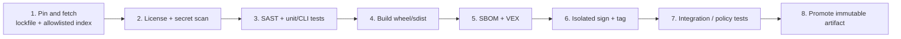

# Deep Ad Slot — Recommended Project Structure Deltas

| Field | Value |
| --- | --- |
| Document ID | DAS-SSB-STRUCT-001 |
| Baseline | DAS-SSB-2026-001 v1.0.0-increment-1 |
| Status | Engineering baseline (extends this repo; not a new monorepo) |
| Date | 2026-08-24 |

This document specifies **deltas** to https://github.com/code4johnm/deep-ad-slot. It does not invent an unrelated topology. Paths are relative to the repository root.

## 1. Current topology (0.1.0, verified)

```
deep-ad-slot/
  assets/                 # branding (logo, icon, social-preview)
  examples/bids.sample.csv
  src/deep_ad_slot/       # package (analyze, fetch, placements, keywords,
                          # orgs, supply, sync, header_bidding, creatives,
                          # bids, report, github_push, models, cli, __main__)
  pyproject.toml          # floating >= dependencies
  requirements.txt        # same floating pins
  README.md
  LICENSE                 # MIT
  .env.example
  .gitignore              # .env, reports/, .venv, dist/, *.egg-info
```

Absent: `tests/`, `conf/`, lockfile, `.github/workflows/`, SBOM output convention, CODEOWNERS.

## 2. Target topology (additive)

```
deep-ad-slot/
  src/deep_ad_slot/                 # unchanged ownership: core analysis TCB
  tests/
    unit/                           # fetch, placements, keywords, sync, bids (no network)
    cli/                            # Typer runner smoke tests; network mocked
    policy/                         # profile contract tests (TEST-* IDs)
  conf/
    profiles.yml                    # source of truth: copy from this baseline then own it
    sbom-policy.yml
  examples/
    bids.sample.csv                 # keep; treat as Tier 3 sample, no real personas
  assets/                           # unchanged
  docs/                             # optional: operator runbook (later increment)
  deep-ad-slot-secure-baseline/     # this package (architecture + seeds)
  evidence/                         # gitignored CI artifacts (SBOM, VEX, junit, licenses)
  .github/
    workflows/ci.yml                # pin → scan → test → build
    workflows/release.yml           # SBOM/VEX → isolated sign → tag
    CODEOWNERS
    PULL_REQUEST_TEMPLATE.md
  pyproject.toml
  requirements.lock                 # or uv.lock — hermetic release
  requirements.txt                  # generate FROM lock, or retire
  .env.example                      # hardened comments (no live secrets)
  .gitignore                        # add evidence/, *.lock except the chosen lockfile
```

Skeletons live today under `deep-ad-slot-secure-baseline/conf/` and `deep-ad-slot-secure-baseline/examples/`. Promotion into `conf/` and `.github/` is an implementation increment.

## 3. Ownership boundaries

| Boundary | Paths | Who reviews | May depend on |
| --- | --- | --- | --- |
| Core analysis TCB | `src/deep_ad_slot/{fetch,analyze,placements,keywords,orgs,header_bidding,sync,creatives,models,supply}.py` | Analysis maintainer + security | httpx, bs4, lxml only as pinned |
| Bid influence | `src/deep_ad_slot/bids.py` | Analysis maintainer | Optional sklearn; no GitHub |
| GitHub integration | `src/deep_ad_slot/github_push.py` plus `cli.py` push flags | Security reviewer | Core report files; PAT |
| CLI surface | `cli.py`, `__main__.py` | All | Must not bypass profile policy |
| Release / C-SCRM | lockfile, `conf/sbom-policy.yml`, workflows | Release owner | No product-logic changes in the same commit as a pin bump unless required |
| Operator state | `reports/`, `.env` | Operator | Never committed |

**Rule:** GitHub integration must not import extra network stacks. Analysis modules must not read `GITHUB_TOKEN`.

## 4. Configuration design

Production settings live in **reviewed files**, not in developer-local overrides that leak into release artifacts.

| File | Role | Profile interaction |
| --- | --- | --- |
| `conf/profiles.yml` | `dev` / `audit` / `prod` contract | CLI `--profile` (target) or `DAS_PROFILE` env; **rebuild/redeploy**, not a hidden weakening of tagged wheels |
| `conf/sbom-policy.yml` | Enforce CISA 2026 minimum elements | Release job fails closed if unmet |
| `pyproject.toml` | Direct dependencies (ranges OK for *development*) | Release job installs from **lockfile** |
| `.env` | Runtime secrets | gitignored; not packed into wheels |

A developer-local `conf/profiles.local.yml` (gitignored) may relax `dev` only. CI for `audit`/`prod` **must not** read it (CM-6, CISA Secure by Design).

Every security-relevant key in `profiles.yml` carries `control_id` and `test_id` (see `deep-ad-slot-secure-baseline/conf/profiles.yml`).

## 5. Evidence the pipeline must emit

Store with the artifact it describes (tag, wheel, or git SHA). Suggested `evidence/` layout (gitignored; uploaded as release assets):

```
evidence/
  <version>/
    deep-ad-slot-<version>-py3-none-any.whl
    deep-ad-slot-<version>.tar.gz
    sbom.spdx.json                 # SPDX 3.x
    sbom.cdx.json                  # optional interchange
    vex.json
    requirements.lock
    licenses.json
    pytest-junit.xml
    pip-audit.json / osv-scan.json
    secret-scan.sarif
    sast.sarif
    hashes.sha256
```

Minimum metadata on the SPDX SBOM: author signature; tool name and version; format name and version; generation context (lifecycle phase = `build` or `release`); component producer, name, version; component hash + algorithm; component license; **full transitive** coverage of the release extra (and sklearn extra if that extra is in the tagged image).

## 6. CI/CD stages



| Stage | Tools (illustrative, not mandated brands) | Fail closed when |
| --- | --- | --- |
| 1 Pin and fetch | `uv lock` or `pip-compile`; pip with `--index-url` allowlist | Lockfile missing; hash mismatch |
| 2 License + secret | `pip-licenses` / `reuse`; `gitleaks` or `trufflehog` | Non-allowlisted license; any token-shaped string in tree |
| 3 SAST + tests | `ruff`, `bandit`, `pytest` | Any test fail; Bandit high on TCB modules |
| 4 Build | `python -m build` | Non-reproducible metadata (version ≠ tag) |
| 5 SBOM + VEX | SPDX 3 generator (e.g. Syft or `spdx-sbom-generator`) + VEX from OSV | Policy `conf/sbom-policy.yml` unmet; incomplete transitive graph |
| 6 Isolated sign | GitHub signed tag and/or Sigstore; job has **no** `GITHUB_TOKEN` with `repo` for product push | Unsigned `audit`/`prod` candidate |
| 7 Policy tests | `tests/policy` against profiles | `prod` profile would allow floating deps or push without flags |
| 8 Promote | GitHub Release assets = wheel + SBOM + VEX + lockfile | Promotion of an artifact whose hash ≠ build hash |

PR CI runs stages 1–4 (and SBOM **generation** without requiring signature). Release workflow runs 1–8 on a tag.

Example workflow: `deep-ad-slot-secure-baseline/examples/github-actions-release.yml.example`.

## 7. Supply-chain controls (NIST SP 800-161)

| Control | Implementation |
| --- | --- |
| Allowlisted sources | Release pip/uv uses PyPI (or a private mirror) only; no ad-hoc URLs in lockfile |
| No floating versions on release branches | Tag job verifies every pin is `==` in the lockfile |
| Third-party intake | New direct dependency requires `examples/third-party-intake.record.example` filled and reviewed |
| Air-gap / private mirror | When the acquirer requires it, set `index-url` to the mirror; do not document a dual-path that silently falls back to the public internet in `prod` |
| Optional extra | `scikit-learn` is an **intake item**; `prod` default extra set is empty unless the program explicitly includes influence-in-release |
| Maintainer compromise | Pin hashes (`--require-hashes`); two-person review on lockfile diffs (`CODEOWNERS`) |

### 7.1 CODEOWNERS (target)

```
/src/deep_ad_slot/github_push.py    @security-reviewer
/src/deep_ad_slot/fetch.py          @security-reviewer @analysis-maintainer
/src/deep_ad_slot/sync.py           @security-reviewer
/conf/                              @security-reviewer @release-owner
/requirements.lock                  @release-owner
/.github/                           @release-owner
```

## 8. Mapping existing modules to pipeline tests

| Module | Test style | Network |
| --- | --- | --- |
| `fetch.py` | URL normalize, same-domain, skip lists, HTML-or-not | Mock httpx |
| `placements.py` / `keywords.py` | Fixture HTML → scores/phrases | None |
| `sync.py` | Fixture HTML → events; `prod` redaction | None |
| `bids.py` | `examples/bids.sample.csv` → delta table; sklearn skipped if absent | None |
| `report.py` | `to_dict` omits `html`; path write under temp dir | None |
| `github_push.py` | Mock httpx; assert no token in raised messages | None |
| `cli.py` | Typer runner: no `--push` ⇒ GitHub client not constructed | None |

## 9. Operator runbook location (later increment)

Target: `docs/operator-runbook.md` covering permissioned-use, `.env` loading, `reports/` retention (30 days suggested), PAT revoke, and how to set GitHub social preview. Not written in increment 1.

## 10. What this increment does **not** do

- Does not move `src/deep_ad_slot/` or rename modules.
- Does not add Docker unless a later increment requests a runtime image (would then add SBOM for the image and SP 800-204 if it becomes a service).
- Does not enable GitHub Actions in `.github/` until an implementation PR copies the example workflow.
